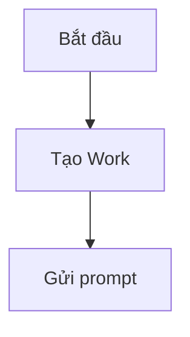

# Kiểm Tra Nhanh Trải Nghiệm Hermes

Checklist này dùng để xác nhận webapp local mở được, không crash, và các luồng chính có phản hồi rõ ràng kể cả khi Hermes hoặc n8n chưa cấu hình đầy đủ.

## Khởi Động

Từ thư mục dự án:

```powershell
cd C:\Users\dtron\Documents\DIRAP-Personal-v3
.\start-dev.ps1 -NoReload
```

Kết quả mong đợi:

- Backend chạy tại `http://127.0.0.1:8000`.
- Frontend chạy tại `http://localhost:5173`.
- Nếu thiếu `.venv`, `node_modules` hoặc `.env`, script in hướng dẫn sửa thay vì crash.
- Nếu port bị chiếm, dừng tiến trình cũ bằng `.\stop-dev.ps1` rồi chạy lại.

## Kiểm Tra Giao Diện Chính

1. Mở `http://localhost:5173`.
2. Bấm `Ctrl + F5` để tải lại bản frontend mới nhất.
3. Kiểm tra sidebar trái cuộn được nếu danh sách dài.
4. Mở `Công việc`, tạo hoặc chọn một Work và hai conversation.
5. Mở `Hermes`, gửi một prompt ngắn và kiểm tra nguồn/context manifest.

Kết quả mong đợi:

- Nếu Hermes thật đã cấu hình, chat bắt đầu stream hoặc hiển thị trạng thái đang xử lý.
- Nếu Hermes hoặc model chậm, UI giải thích là có thể do provider/model, conversation dài hoặc chờ phê duyệt.
- Nếu Hermes thiếu cấu hình, UI hiển thị lỗi dễ hiểu và cách sửa.

## Kiểm Tra File Workspace

1. Trong Work, mở tab `Tài liệu`.
2. Mở một file text nhỏ trong workspace.
3. Sửa nội dung.
4. Chờ autosave hoặc bấm nút lưu thủ công.

Kết quả mong đợi:

- Trạng thái đổi từ `Chưa lưu` sang `Đang lưu...` rồi `Đã lưu`.
- File quá lớn hoặc binary hiển thị lỗi dễ hiểu.
- Nếu file bị đổi bên ngoài app, UI cho chọn `Tải lại` hoặc `Lưu đè`.

## Kiểm Tra Kỹ Năng Và Bộ Nhớ

1. Mở `Thư viện`, kiểm tra Knowledge và kỹ năng approved + enabled.
2. Bật/tắt kỹ năng và xác nhận trạng thái đổi rõ ràng.
3. Mở Memory Hub trong khu vực nâng cao; xác nhận proposal không auto-activate/auto-inject.
4. Tìm kiếm bằng từ khóa.

Kết quả mong đợi:

- Empty state giải thích cần thêm gì.
- Kết quả tìm kiếm lọc đúng.
- Các mục mới xuất hiện sau khi lưu.

## Kiểm Tra Dữ Liệu Cục Bộ

1. Mở `Cài đặt` -> `Chẩn đoán nâng cao` -> `Dữ liệu cục bộ`.
2. Kiểm tra số phiên, tin nhắn, task run, audit event và dung lượng DB.
3. Bấm `Tạo backup DB`.

Kết quả mong đợi:

- Hiển thị phạm vi backup DB-only hay gồm managed workspace; không lộ raw system path ở UI thường.
- Backup tạo file mới, không ghi đè bản cũ.
- Không có thao tác xóa dữ liệu thật.

## Kiểm Tra Mermaid

Dán hoặc yêu cầu Hermes tạo đoạn:

````markdown

````

Kết quả mong đợi:

- Sơ đồ render được.
- Có nút xuất SVG/PNG.
- Mermaid sai cú pháp không làm crash chat.

## n8n Tùy Chọn

Chỉ chạy khi đã cấu hình secret trong `infra/n8n/.env`:

```powershell
cd infra\n8n
docker compose up -d
```

Kết quả mong đợi:

- n8n chỉ bind local tại `127.0.0.1:5678`.
- Gọi workflow thật vẫn cần approval.
- Audit không lưu raw payload hoặc secret.
- Nếu n8n chưa cấu hình, UI báo tùy chọn/unavailable rõ ràng và toàn bộ Work flow vẫn dùng được.

## Kiểm Tra Action Package

1. Yêu cầu Hermes đề xuất cập nhật trạng thái Work hoặc một bước kế hoạch.
2. Xác nhận proposal hiển thị nhưng Work/plan chưa đổi.
3. Bấm `Tạo gói đề xuất`, xem Work đích và before/after, rồi approve.
4. Tải lại và xác nhận executor chỉ áp dụng đúng một lần.

Kết quả mong đợi: MCP không tự ghi Work; deny/cancel không tạo mutation; Work archived từ chối proposal/package/mutation.
